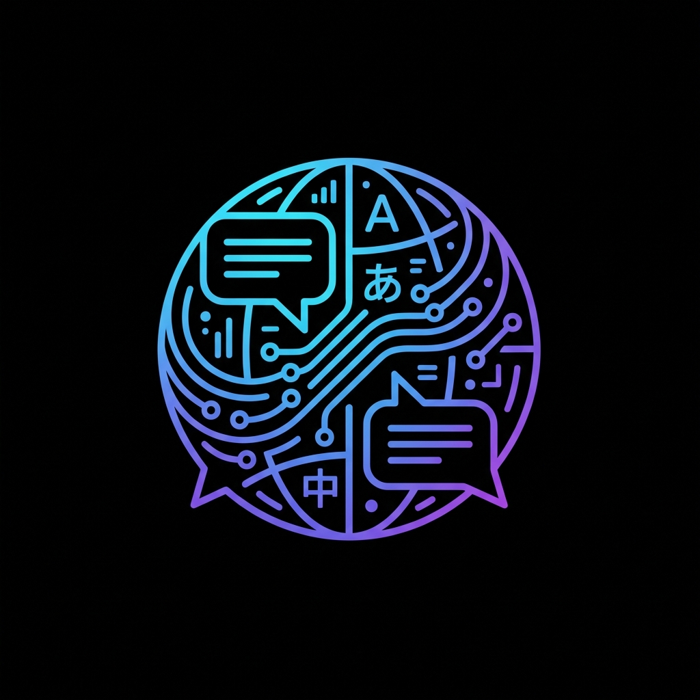
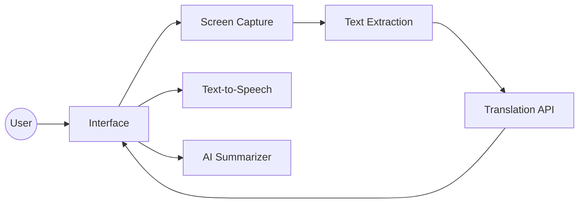
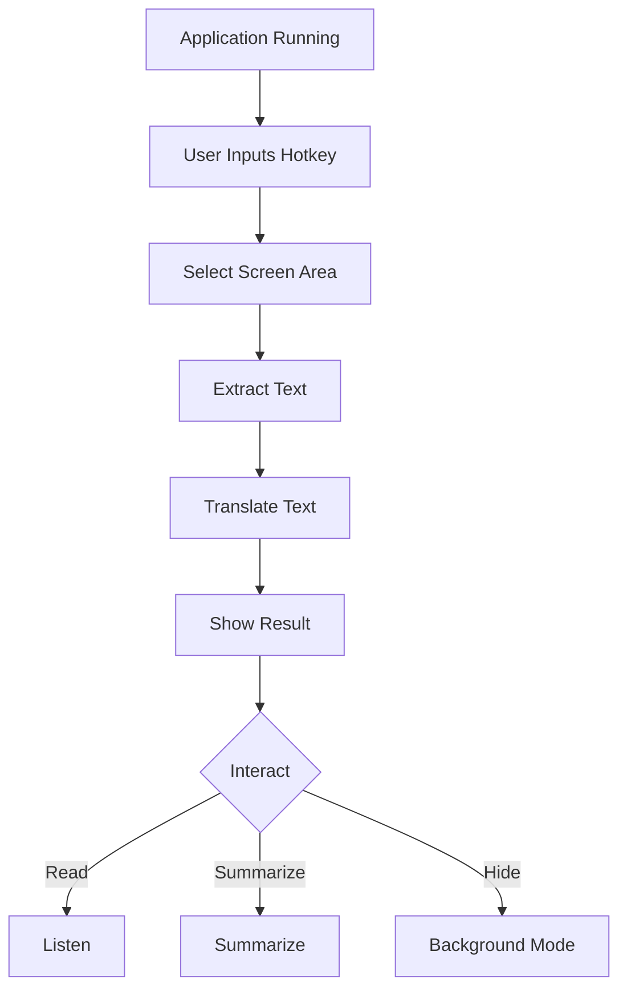

#  Lingo-Live

**Lingo-Live** is a powerful, real-time screen translation tool designed for seamless multilingual experiences on your desktop. Run it in the background, select any text on your screen (images, PDFs, videos), and get instant translations, summaries, and audio readouts—all without leaving your current window.



---

##  Features

- ** OCR & Translation**: Instantly capture any screen region and translate text using advanced OCR (Tesseract) and translation APIs (Lingo.dev optimized).
- ** Text-to-Speech (TTS)**: Listen to translations with high-quality, natural-sounding voices (via Microsoft Edge TTS).
- ** AI Summarization**: Get concise summaries of long translations using **Google Gemini 1.5 Flash**.
- ** Modern Settings UI**: Customize your experience with a beautiful, user-friendly settings panel built with CustomTkinter.
- ** Persistent & Unintrusive**: Runs quietly in the background. Toggle visibility instantly or minimize to tray (conceptual).
- ** Global Hotkeys**: Trigger translations from anywhere with `Ctrl+Alt+T` (customizable).
- ** Theming**: Auto-adapts to your system theme (Dark/Light).

---

##  Installation

### Prerequisites
1. **Python 3.8+** installed.
2. **Tesseract OCR** installed:
   - [Windows Installer](https://github.com/UB-Mannheim/tesseract/wiki)
   - Add Tesseract to your PATH or configure it in Settings.

### Steps
1. **Clone the repository**:
   ```bash
   git clone https://github.com/your-username/lingo-live.git
   cd lingo-live
   ```

2. **Install dependencies**:
   ```bash
   pip install -r requirements.txt
   ```
   *Note: Ensure `edge-tts` and `pygame` are installed for TTS features.*

3. **Run the Application**:
   ```bash
   python main.py
   ```
   *Or use `run.bat` for quick launch.*

---

##  Usage

1. **Start Lingo-Live**: The app will launch and run in the background.
2. **Select Text**:
   - Press **`Ctrl+Alt+T`** (default hotkey).
   - The screen will dim. Click and drag to select the text you want to translate.
3. **View Results**: The overlay window will appear with the captured text and its translation.
4. **Interact**:
   -  **Read Aloud**: Click the speaker icon to hear the translation.
   -  **Summarize**: Click the sparkle icon to get a summary.
   -  **New**: Click to capture a new area.
   -  **Hide**: Click 'X' or press `Esc` to hide the window (app keeps running).
5. **Settings**: Click the settings icon to change hotkeys, languages, opacity, and API keys.

---

##  System Architecture

###  Block Diagram

A high-level view of the system components.



---

###  Workflow

The simple process from selection to translation.



---
##  Tech Stack

| Component | Technology | Description |
| :--- | :--- | :--- |
| **Language** | **Python** | Core logic and scripting. |
| **GUI** | **CustomTkinter** | Modern, dark-mode friendly UI framework. |
| **OCR** | **Tesseract** | Optical Character Recognition engine. |
| **Translation** | **Lingo.dev** | Specialized translation API. |
| **AI** | **Google Gemini** | LLM for intelligent text summarization. |
| **TTS** | **Edge TTS** | High-quality neural voice synthesis. |
| **Audio** | **Pygame** | Robust audio playback for TTS. |
| **System** | **Keyboard** | Global hotkey hooks and input management. |

---

##  Project Structure

```bash
lingo-live/
├── assets/              # Images and resources
├── src/
│   ├── services/        # Core business logic
│   │   ├── gemini_service.py      # AI Summarization
│   │   ├── ocr_service.py         # Tesseract integration
│   │   ├── translation_service.py # Lingo.dev API wrapper
│   │   └── ...
│   ├── app.py           # Main application logic & UI
│   ├── config.py        # Global configuration
│   └── settings_manager.py # Persistent settings handler
├── main.py              # Application entry point
├── requirements.txt     # Python dependencies
├── run.bat              # Quick launcher script
└── settings.json        # User configuration (generated)
```

---

##  License

Distributed under the MIT License. See `LICENSE` for more information.
